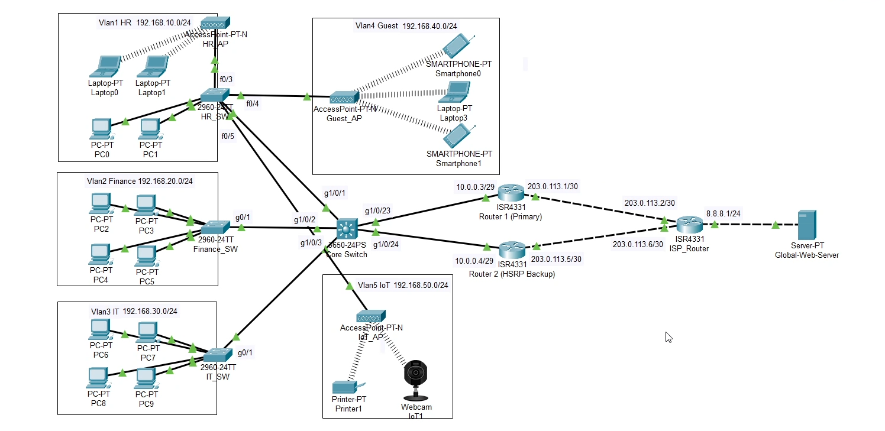
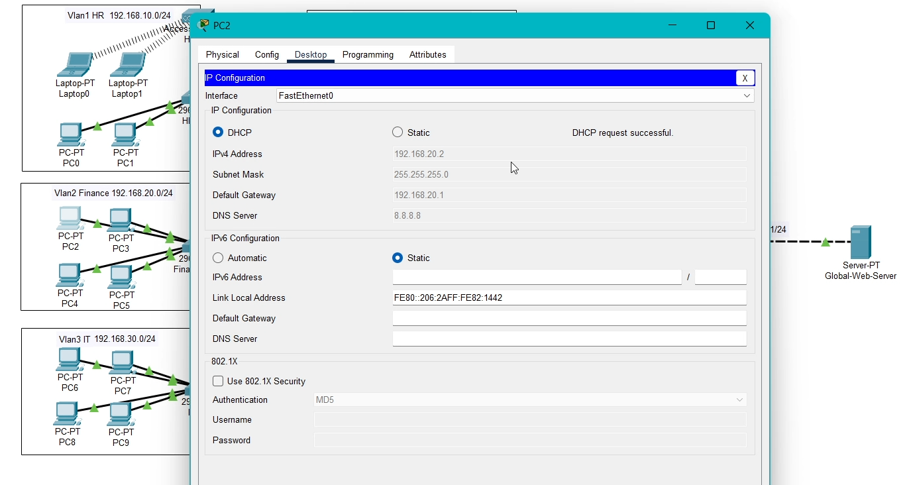
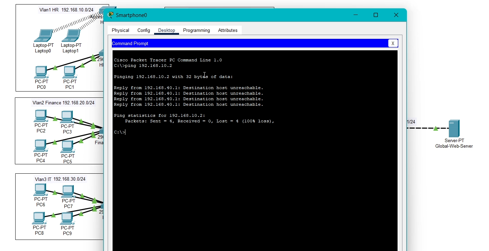
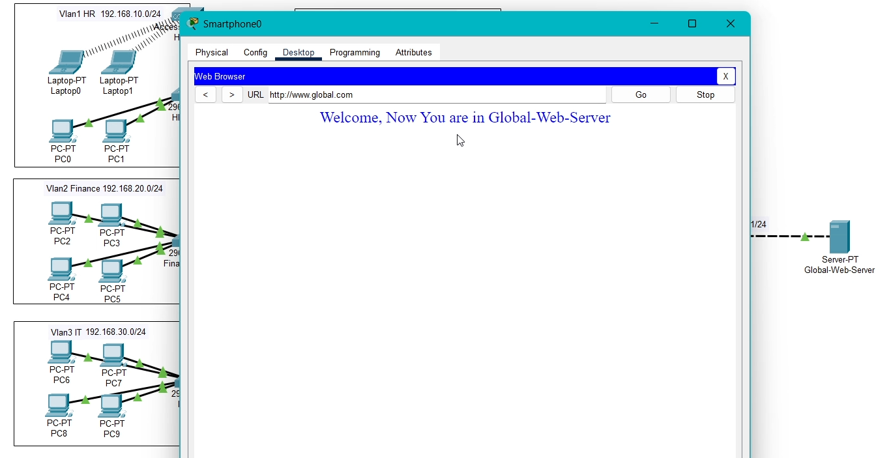
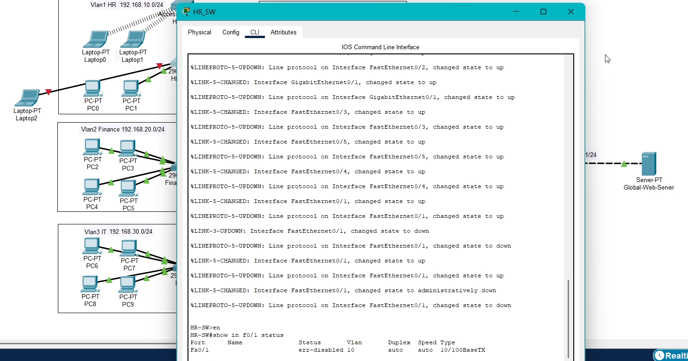
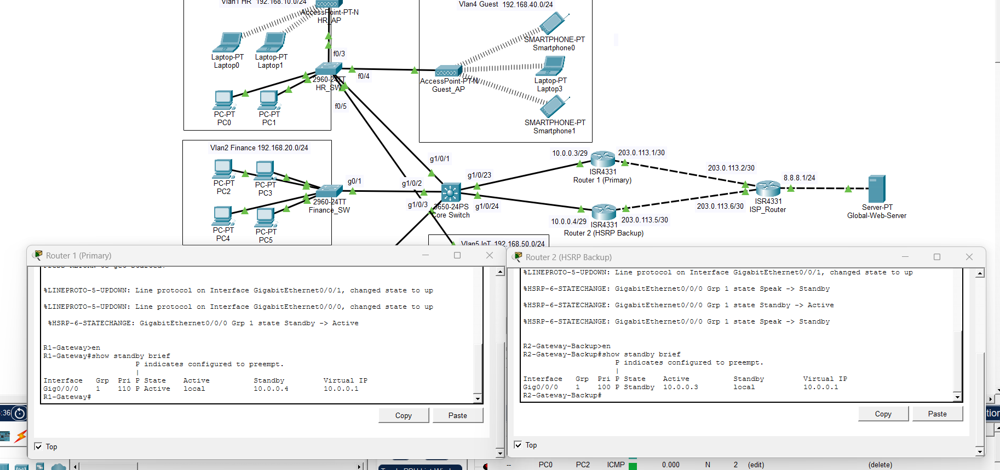

# Secure & Redundant Enterprise Network Infrastructure

## Demo Video
Watch the full project demo: [Click here](https://1drv.ms/v/c/ca84ccba0e93da2d/IQAlBwVCO9sIT7KLPtLUsMttAaKrQELJoJlDd_sfB00EYK4?e=FHEBSz)

## Overview
Designed and deployed a full multi-departmental enterprise network
in Cisco Packet Tracer. Built on a 3-layer hierarchical model
(Access, Core, Edge) with 5 VLANs, HSRP redundancy, Zero-Trust
ACLs, centralized DHCP, NAT/PAT, and physical port security.
All 5 verification tests passed successfully.

## Architecture
- Access Layer: Cisco 2960 switches per department
- Core Layer: Cisco 3650 Multi-Layer Switch (inter-VLAN + DHCP)
- Edge Layer: Dual Cisco ISR4331 routers (HSRP failover)

## Features Implemented

### VLAN Segmentation
5 VLANs isolating HR, Finance, IT, Guest, and IoT traffic.
Reduces broadcast domains and limits lateral movement between departments.

### High Availability (HSRP)
Dual edge routers configured with Hot Standby Router Protocol.
Automatic failover in under 3 seconds if primary router fails.

### Zero-Trust Security (ACL)
Extended ACL on edge gateway blocks Guest VLAN from reaching
any internal corporate subnet while permitting internet access.

### Physical Port Security
Access layer switches hardened with mac-address sticky.
Rogue device connection triggers immediate err-disabled state.

### Core Services
- DHCP: Centralized on Core Switch - leases IP, mask, DNS to all VLANs
- DNS: www.global.com mapped to public IP 8.8.8.8
- NAT/PAT: NAT overload translates all internal IPs to single public address

## Verification Results
| Test | Result |
|------|--------|
| DHCP distribution across VLANs | PASS |
| Inter-VLAN routing (HR ping IT) | PASS |
| Internet access via domain name | PASS |
| HSRP failover under 3 seconds | PASS |
| Port security err-disabled trigger | PASS |

## Tools Used
Cisco Packet Tracer, Cisco IOS CLI,
Cisco 2960/3650/ISR4331 devices

## Files in This Repo
- [Project Report](network.pdf)
- [Network_config](config/network-summary.md)
- [Screenshots](screenshots)

## Screenshots
- DHCP Lease

- ACL Blocking Guest

- Guest Internet Access

- Port Security

- HSRP Verification

